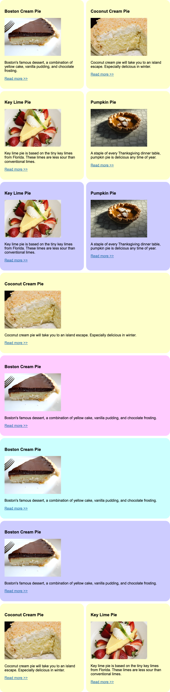

# CSS Grid

It is a great example of CSS Grid by Jen Kramer on the Front End Master course which I practice and the website's visual design is available below.

Note: Updated card radius and padding compared to Jen Kramer's design.

Desktop

Tablet

Mobile

