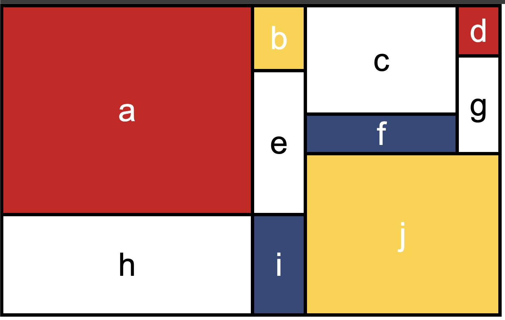

# CSS Grid

A great example of CSS Grid Layout by Jen Kramer on the Front-end Master course which I practice and the website's visual design is available below.

<h4>Orginal Design</h4>

<h4>By Me</h4>

